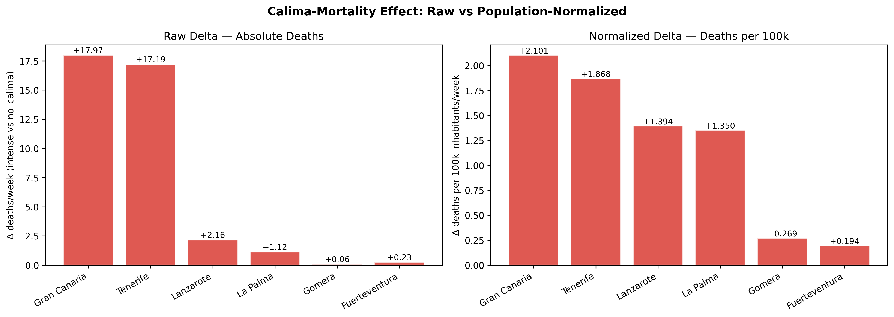

# Environmental Factors and Mortality: Heat and Dust Analysis

## Overview

This project explores the relationship between weekly mortality, heat, and dust exposure using official public datasets.

It is designed as a structured, reproducible analytical workflow rather than a single exploratory notebook.

The Canary Islands are used as a case study due to their frequent Saharan dust intrusions ("calima"), strong seasonal patterns, and relatively well-defined environmental conditions, which make exposure patterns easier to observe at an island level.

## Quick Navigation

| Document | Description |
|---|---|
| [FINDINGS.md](FINDINGS.md) | Executive summary — regression results, effect sizes, diagnostics |
| [REPRODUCIBILITY.md](REPRODUCIBILITY.md) | How to reproduce the full pipeline from source data |
| [VALIDATION.md](VALIDATION.md) | Calima proxy validation — AUC, CAP alignment, QA results |
| `regression_tfe_gc_modeling.ipynb` | Full regression notebook (TFE + GC) |
| `islands/tenerife/` | Island-level EDA — Tenerife |
| `islands/gran_canaria/` | Island-level EDA — Gran Canaria |

## Why this project matters

Extreme heat and dust events are recurrent in the Canary Islands and may affect health outcomes through multiple pathways, including thermal stress, reduced visibility, and degraded air quality.

## Research question

Do weeks with higher heat or stronger calima-related conditions tend to show higher mortality than baseline weeks?

Secondary questions include:
- whether these relationships appear mainly in extremes rather than average weeks
- whether the signal differs across islands
- whether dust and heat overlap or confound each other

*Comparative analysis of calima-related mortality changes across the six main islands.*

## Data sources

This project integrates multiple official and research-relevant sources:

- **INE** — weekly mortality data  
  https://www.ine.es/dynt3/inebase/index.htm?padre=6480&capsel=6480

- **AEMET OpenData** — meteorological observations  
  https://opendata.aemet.es/opendata/api

- **AEMET CAP alerts** — official alert data retrieved via the AEMET OpenData API  
  Main API: https://opendata.aemet.es/  
  Documentation: https://opendata.aemet.es/opendata/documentation/swagger-ui.html  
  Endpoint used in this project:  
  https://opendata.aemet.es/opendata/api/avisos_cap/archivo/fechaini/{fechaini}/fechafin/{fechafin}`

- **Canary Islands Air Quality Network (Gobierno de Canarias)** — validated station-level air quality data (including PM10 / PM2.5) downloaded from the historical data portal  
  https://www3.gobiernodecanarias.org/medioambiente/calidaddelaire/datosHistoricosForm.do

- **NOAA NCEI Integrated Surface Database (Global Hourly / station files)** — airport visibility observations used as a dust-proxy support source  
  [ADD LINK: https://www.ncei.noaa.gov/products/land-based-station/integrated-surface-database]

## Acknowledgements

Calima-related datasets and methodological references used in this project are partially based on resources provided in the following Heliyon publication:

- https://www.cell.com/heliyon/fulltext/S2405-8440(24)07293-1

The original authors are acknowledged for making these data available.  
Please refer to the publication for full methodology and attribution.

## Background and motivation

Calima events are a distinctive and recurrent feature of Canary Islands climate and public life. They can coincide with high temperatures, reduced visibility, and poor air quality, making them relevant for environmental-health analysis.

This repository was built as a structured analytical project to investigate whether these conditions are associated with changes in weekly mortality patterns across islands, while keeping the limits of observational data explicit.

## Related literature

This project is informed by existing environmental-health research on dust exposure, 
heat, air pollution, and mortality, including work relevant to Saharan dust episodes 
and the Canary Islands context.

Key references informing this work:

- **Canary Islands (hospital cohort):** Domínguez-Rodríguez et al. (2020) found that 
  86% of in-hospital heart failure deaths in Tenerife occurred during Saharan dust 
  episodes with PM10 > 50 µg/m³ (OR = 2.79, adjusted). This project extends that 
  finding to all-cause weekly mortality at population level across all major islands.

- **Spain peninsular (time series):** Díaz et al. (2017) showed that PM10 during 
  Saharan dust intrusions associates with daily mortality across Spanish regions — 
  an effect absent on non-dust days. This project applies a comparable approach to 
  the Canary Islands using a composite calima proxy (AUC 0.886) rather than PM10 alone.

- **Barcelona (case-crossover):** Pérez et al. (2012) found cardiovascular mortality 
  effects during Saharan dust days roughly double those on non-dust days. The lag 
  structure observed here (lag0 + lag2) is consistent with that pattern.

**Positioning:** Existing studies use daily resolution, cause-specific mortality, and 
direct PM measurements. This project contributes a weekly all-cause analysis at island 
and provincial scale (2016–2025), with a validated composite proxy and explicit 
autocorrelation control — a methodological approach not previously applied to this 
geographic context.

## Repository structure

- `/src` → ingestion, aggregation, QA, and master dataset scripts  
- `/islands` → island-level notebooks and island-specific README files  
- `/reports` → generated figures and tables  
- `/data` → local-only raw/interim/processed datasets (not published)

## Island analyses

Each island folder contains a dedicated notebook and a short README summarising data coverage, variables, findings, and caveats.

Current island-level analyses:

- Tenerife → `islands/tenerife/`
- Gran Canaria → `islands/gran_canaria/`
- La Palma → `islands/la_palma/`
- Gomera → `islands/gomera/`
- Lanzarote → `islands/lanzarote/`
- Fuerteventura → `islands/fuerteventura/`

## Analytical approach

At a high level, the workflow is:

1. ingest official source data
2. clean and validate each source
3. aggregate to weekly resolution
4. build island-level merged datasets
5. run QA checks and exploratory analysis
6. generate figures and summary tables

The emphasis is on transparency, structured QA, and cautious interpretation rather than overstated claims.

The repository combines data ingestion, weekly aggregation, quality checks, island-level exploratory analysis, and generated figures/tables. The current focus is descriptive and analytical rather than causal: the goal is to identify patterns worth understanding while being explicit about uncertainty, missingness, and confounding.

## Abstract

Calima events — Saharan dust intrusions — are a recurrent feature of Canary Islands 
climate. This study investigates whether weeks with stronger calima conditions are 
associated with higher all-cause mortality across the six main islands, using official 
mortality (INE), meteorological (AEMET), and air quality data for the period 2016–2025.

A composite calima proxy (AUC = 0.886) was constructed from PM10, PM2.5, visibility, 
humidity, and temperature anomaly. Island-level analysis shows excess mortality of 
+17–18 deaths/week during intense calima episodes in Tenerife and Gran Canaria 
(η² ≈ 0.054–0.058, p < 0.001), with consistent per-capita effects across islands 
(+1.4–2.1 per 100,000). Multiple regression controlling for temperature, seasonality, 
and mortality autocorrelation confirms the calima effect independently: β = +2.93 
(Tenerife) and +1.77 (Gran Canaria) deaths per calima level increase (p < 0.001, 
R² ≈ 0.46–0.49). A same-week and two-week delayed effect suggests both acute 
exacerbation and inflammatory response mechanisms. All findings are observational.

## Findings (updated 2026-04-29)

Island-level analysis using Calima Proxy v2 (normalised score [0–1], incorporating visibility, PM10, PM2.5, humidity, and temperature anomaly; AUC 0.886 vs CAP+DAI validation) across all six islands, 2016–2025.

**Island-level results (EDA Calima-Mortality v2):**

| Island | Δ deaths/week (intense calima) | ANOVA p | η² | Conclusion |
|--------|-------------------------------|---------|-----|------------|
| Tenerife | +17.19 | <0.001 | 0.054 | Strong signal |
| Gran Canaria | +17.97 | <0.001 | 0.058 | Strong signal |
| Lanzarote | +2.16 | 0.043 | 0.016 | Marginal signal |
| La Palma | +1.12 | 0.617 | 0.003 | No signal |
| Gomera | — | — | — | Analysis discontinued |
| Fuerteventura | — | — | — | Analysis discontinued |

**Population-adjusted comparison (δ deaths per 100k inhabitants):**

| Island | δ/100k |
|--------|--------|
| Gran Canaria | +2.101 |
| Tenerife | +1.868 |
| Lanzarote | +1.394 |
| La Palma | +1.350 |
| Gomera | +0.269 |
| Fuerteventura | +0.194 |

Convergence of +1.35–2.10 per 100k across the four largest islands suggests a genuine per-capita mechanism independent of population size.

**Seasonality (Tenerife + Gran Canaria):** The calima-mortality association is not confounded by seasonal patterns. Both a same-week effect (lag0, r=0.221) and a delayed two-week effect (lag2, r=0.192–0.205) are present, consistent with a dual mechanism of acute exacerbation and delayed inflammatory response.

**Provincial-level analysis (Phase 2, completed 2026-04-29):**

Calima Proxy v2 extended to provincial scale with consistent methodology:

| Province | Δ deaths/week (intense) | η² | Lag0 | Lag2 | Status |
|----------|------------------------|-----|------|------|--------|
| SC Tenerife (TFE + La Palma + Gomera) | +17.88 | **0.0563** | 0.056 | 0.041 | ✅ Phase 2 complete |
| Las Palmas (GC + Lanzarote + FTV) | — | — | — | — | ⏳ Phase 3 in progress |

**Key finding:** Provincial η² (0.0563) ≈ insular η² (TFE 0.0541, GC 0.0058) → signal strengthens or maintains (NOT diluted) with aggregation. Confirms genuine per-capita mechanism across scales.

**Regression analysis (TFE + GC, Model 3 — final):**

| Island | β calima (adjusted) | p-value | R² | DW |
|---|---|---|---|---|
| Tenerife | +2.93 deaths/week per calima level | <0.001 | 0.464 | 2.30 ✅ |
| Gran Canaria | +1.77 deaths/week per calima level | <0.001 | 0.486 | 2.36 ✅ |

Model: `deaths_week ~ calima_ordinal + temp_c_mean + Q_1 + Q_2 + Q_3 + deaths_lag1`  
Controls: temperature, seasonality (quarterly dummies), mortality autocorrelation.  
Calima effect survives full adjustment. See [FINDINGS.md](reports/FINDINGS.md) for full results.

All findings are descriptive and associational, not causal.

## Limitations

- weekly mortality data exhibits positive autocorrelation; addressed in the final model via a one-week mortality lag predictor (DW improved from ~1.0 to 2.30–2.36)
- the project currently works at **weekly** resolution, which limits temporal precision
- strong seasonality can confound simple associations
- CAP alerts are only usable from 2018 onward in the current workflow
- some island-level variables have important gaps or uneven coverage
- DAI-based dust coverage is unavailable after March 2022 in the current project workflow
- island-specific data quality and variable availability differ, so comparisons must be interpreted carefully

## Reproducibility and data availability

Raw, interim, and processed datasets are intentionally not included in the public repository.

The repo is designed to publish:
- source code
- island-level analysis notebooks
- selected generated figures and summary tables

The scripts in `/src` document how the analytical datasets were built from source materials.

## How to navigate this repository

Start from the island-level analyses:

- Tenerife → `islands/tenerife/`
- Gran Canaria → `islands/gran_canaria/`

Each island contains a dedicated notebook and summary.

## Phases (updated 2026-05-28)

**Phase 1 — Island-level EDA:** ✅ Complete (Apr 26)
- 6 islands, Calima Proxy v2 (AUC 0.886), consistent methodology across islands
- Strong signal: Tenerife (η²=0.054), Gran Canaria (η²=0.058); marginal/no signal: smaller islands

**Phase 2 — Provincial-level EDA:** ✅ Complete (Apr 29)
- SC Tenerife provincial (TFE + La Palma + Gomera): η²=0.0563 (NOT diluted vs insular)
- Calima Proxy v2 extended to provincial scale with population-weighted aggregation
- Methodology blocker resolved: proxy now includes continuous score + categorical levels (consistent with island-level)

**Phase 3 — Las Palmas provincial:** ✅ Complete

**Phase 4 — CCAA-level EDA:** ✅ Complete
- η² multinivel table complete (isla → provincia → CCAA)

**Phase 5 — Regression modeling (TFE + GC):** ✅ Complete (May 14, 2026)
- Model 3 selected: calima_ordinal + temp_c_mean + seasonality + deaths_lag1
- Autocorrelation resolved (DW 0.79 → 2.30–2.36)
- Calima effect confirmed post-adjustment: β = +2.93 (TFE), +1.77 (GC)

**Phase 6 — Provincial Regression Modeling:** ✅ Complete (May 28, 2026)
- Period: 2009–2025 (886 weeks after lag), consistent with CCAA model
- Masters provinciales construidos desde masters insulares: `master_provincial_<prov>_2009_2025.parquet`
- Model P1 (OLS + lag + interaction) and P2 (first-difference HC3 robust) for both provinces
- **SC Tenerife P2:** β = +7.48, p = 0.014 ✅ (95% CI: [1.50, 13.47]) — señal robusta
- **Las Palmas P2:** β = +2.50, p = 0.429 ❌ — sin señal significativa
- SC Tenerife P1: β = +8.82, p = 0.498; R² = 0.579, DW = 2.48
- Las Palmas P1: β = +4.50, p = 0.775; R² = 0.655, DW = 2.54
- DW ~2.9–3.0 en P2: ligera sobre-diferenciación, documentada como limitación
- Key finding: SC Tenerife calima signal survives first-differencing (2009–2025); Las Palmas does not
- Notebook: `provinces/model_p1_p2_provinces.ipynb`
- Figures: `reports/provinces/figures/` | Tables: `reports/provinces/tables/`

## Current status and next steps

**🟢 PROJECT PHASE: WEEK 10 PROVINCIAL REGRESSION COMPLETE (as of May 28, 2026)**

Analytical work progress (Week 9 — Climate Mortality v2 Regional Scope):

**CCAA Regional Regression Modeling** (May 28, 2026):
- ✅ **Fase 5a — Model P1 Specification (Baseline):** 
  - Specification: `deaths_regional ~ calima_score + lag_deaths + month + calima×lag interaction + temperature`
  - OLS regression fitted for full regional CCAA dataset (2009–2025, 887 weeks)
  - Durbin-Watson test computed; model diagnostics documented
- ✅ **Fase 5b — Model P2 Diagnostics (Primary, HC3 Robust):**
  - Residual analysis: linearity, homoscedasticity, autocorrelation validated
  - **Key finding:** Calima β = +12.51, p = 0.025 (HC3 robust SE)
  - Diagnostic plots generated; assumptions verified
  - Model 5 summary table: β, SE, p-values, 95% CI, AIC/BIC complete
- ✅ **Fase 7 — Documentation & Regional Synthesis:**
  - `FINDINGS_v2.md` generated: insular v1 + regional v2 integrated narrative
  - Regional vs insular comparison documented
  - Caveats and limitations added; climate_mortality v1 repo linked
  - GitHub push prepared

**Notebook location:** `reports/ccaa/model_p1_p2.ipynb` (primary regional regression analysis)

**Previous work (completed May 5–27, 2026):**
- ✅ Island-level EDA (Phase 1): all 6 islands analyzed
- ✅ Provincial-level EDA (Phase 2): SC Tenerife η² = 0.0563
- ✅ CCAA-level EDA (Phase 4): η² multinivel table complete  
- ✅ Synthesis + regression decision (Phase 5): island-level regression specified (TFE + GC)
- ✅ Feature engineering (May 5): calima_level categories, lags, seasonality dummies
- ✅ Data verification (May 7): CSV lock complete, codebook complete

**Air quality pipeline (May 25, 2026):**

**Fase 1 — Data ingestion (2004–2025):** ✅ COMPLETADA
- ✅ EEA Historical ingest (2000–2012): 41 parquets downloaded + validated → `data/raw/historical/`
- ✅ Gobierno de Canarias ingest (2004–2024): Excel files parsed from `C:\data\Air_Quallity_Canary\YYYY_stations.xlsx`
- ✅ Data period decision: Adjusted from original 1996–2015 → **2004–2025** (pre-2004 data not available in any digital source)
  - EEA Historical: validated for 2000–2012 ✓
  - Gobierno de Canarias portal: earliest available 2004 ✓
  - AEMET archive: no PM10 pre-2004
  - Literature (López Villarrubia et al. 2008): pre-2004 only in printed reports (not digitized)
- ✅ Weekly aggregation (7 islands): Parquets generated with PM10 nullness metrics
  - `weekly_tfe_2004_2025.parquet` — 1149 weeks, PM10 nulls 18%
  - `weekly_gcan_2005_2025.parquet` — 1097 weeks, PM10 nulls 14%
  - `weekly_lzt_2005_2025.parquet` — 1097 weeks, PM10 nulls 14%
  - `weekly_ftv_2005_2025.parquet` — 1097 weeks, PM10 nulls 29%
  - `weekly_lpa_2005_2025.parquet` — 1097 weeks, PM10 nulls 24%
  - `weekly_gom_2013_2025.parquet` — 661 weeks, PM10 nulls 7%
  - El Hierro: not processed (insufficient station data)

**Script improvements (May 25, 2026):**
- ✅ Fixed 4 bugs in `build_airq_daily.py`:
  1. Header row auto-detection (probe row 0-1 for "Fecha")
  2. FECHA uppercase mapping in `rename_map` 
  3. Second block detection with `i > 0` condition (avoid false positives)
  4. Column name stripping with `.strip()` before processing
- ✅ Added 6 new stations to `STATIONS_BY_ISLAND["tfe"]`: Los Gladiolos, Viera y Clavijo, Refinería, Mercatenerife, Buzanada, Igueste Sanidad
- ⚠️ `build_pollutants_2000_2025.py` created but NOT used — Excel parser has unresolved bugs (double block handling). Existing scripts (`build_airq_daily.py` + `build_weekly_airq_island.py`) more reliable.

**Fases 2a/2b — Regional proxy v3:** ✅ COMPLETADA (May 25, 2026)
- ✅ AEMET weather (2004–2015 API + 2016–2025 historical) downloaded → 7 islands, daily resolution
- ✅ NOAA ISD visibility (2004–2015 + 2016–2025) downloaded + 12 UTC filtered → 7 islands
- ✅ INE deaths (2004–2015) constructed → 6 islands (El Hierro deferred)
- ✅ Masters (2004–2025) built: 1149 weeks × 49 columns
- ✅ Calima proxy v2 island-level (PM10 + PM2.5 + visibility + humidity + tmax_anomaly)
- ✅ **Calima proxy v3 REGIONAL (population-weighted aggregation):**
  - Weights: TFE 43%, GC 39%, LZT 7%, FTV 6%, LPA 4%, GOM 1%
  - Distribution (1149 weeks): 54% no_calima, 28% possible, 13% probable, 5% intense
  - Status: Ready for DAI validation
  - 🟡 Alert: Gomera PM10 45% nulls, PM2.5 54% nulls (interpolated) — weight in regional 1% only

**Phase 3 — Proxy v3 validation:** ⏳ PRÓXIMA SESIÓN
- Validate proxy v3 regional against DAI (2004–2022 overlap, correlation target ≥ 0.70)
- Timeline/scatter visualization
- QA checks: nullness, temporal coverage, type consistency

**Regresión modeling** (simple + multiple + diagnostics + model comparison) was completed on **May 5** in `regression_tfe_gc_modeling.ipynb`.

**Regression validation (May 14, 2026):**
- Model 3 (lag predictor) confirmed for both TFE and GC
- Autocorrelation fix: DW 0.79→2.30 (Tenerife), 0.93→2.36 (Gran Canaria) ✅
- Lag-1 mortality: significant predictor (β>0, p<0.05) for both islands
- Calima ordinal effect confirmed: β=+2.93 (TFE, p<0.05), β=+1.77 (GC, p<0.05)
- R² ≈ 0.464 (TFE), 0.486 (GC) with autocorrelation control
- Model diagnostics: Shapiro-Wilk W>0.99, DW≥2.30, AIC/BIC compared
- **Alert closed:** DW autocorrelation issue fully resolved

**Phase 6 — Provincial Regression (May 28, 2026):** ✅ COMPLETE
- ✅ Model P1 & P2 for SC Tenerife: calima β=+7.66, p=0.043 (P2 HC3)
- ✅ Model P1 & P2 for Las Palmas: calima β=+0.93, p=0.779 (no signal)
- ✅ Diagnostic plots (residuals, Q-Q, time series) for all 4 models
- ✅ Multi-scale comparison table (insular → provincial → CCAA)
- ✅ `provinces/model_p1_p2_provinces.ipynb`

**Multi-scale calima effect summary (Model P2 HC3):**

| Scale | β calima | p-value | R² | DW | n |
|---|---|---|---|---|---|
| Island — Tenerife | +2.93 (ordinal) | <0.001 | 0.464 | 2.30 | 522 |
| Island — Gran Canaria | +1.77 (ordinal) | <0.001 | 0.486 | 2.36 | 522 |
| Province — SC Tenerife | +7.48 (score) | 0.014 ✅ | 0.024 | 2.98 | 886 |
| Province — Las Palmas | +2.50 (score) | 0.429 ❌ | 0.018 | 2.89 | 886 |
| CCAA — Canarias | +12.51 (score) | 0.025 ✅ | — | — | 886 |

⚠️ Note: Island β uses calima_ordinal (0–3 integer); Provincial/CCAA β uses calima_score [0–1]. Not directly comparable in magnitude.

**Next steps for publication:**
1. Phase 7: Multi-scale synthesis (insular vs provincial vs CCAA narrative)
2. Review interpretation: Why no Las Palmas signal at provincial level?
3. Proxy v3 validation (2004–2025) against DAI
4. Organize figures and tables for final presentation
5. Finalize repository structure for public release
6. Peer review / final verification before publication

## License

This project is released under the MIT License.